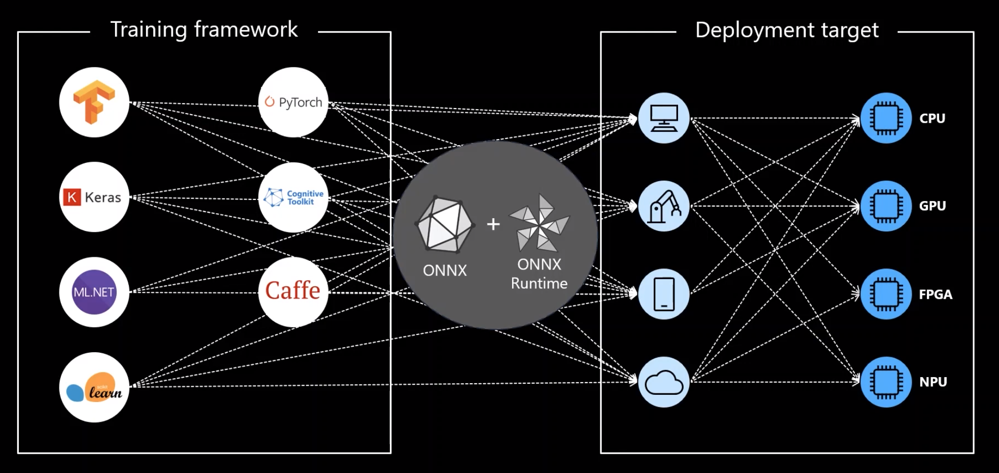

# ONNX Hello World


[](https://github.com/mmgalushka/bootwrap/blob/main/LICENSE)

This project provides educational material for using [Open Neural Network Exchange (ONNX)](https://onnx.ai/). These materials would be useful for data scientists and engineers who are planning to use the ONNX ML models in their AI projects. Notebooks will help you to find answers to the following questions: 
* How I can convert my ML classification [SKLearn](https://scikit-learn.org/stable/), [XGBoost](https://xgboost.readthedocs.io/en/latest/), and [Tensorflow (Keras)](https://www.tensorflow.org/) models into the ONNX format? 
* What is the difference between the original ML model and the model converted into the ONNX?
* Where I can find and how I can use already trained and serialized ONNX models?
* How I can visualize the ONNX graph?

**Note:** In notebooks, we will not spend time performing data cleaning, feature selection, model optimization, and etc. This project is not about building the best models, it is about ONNX!

## What is ONNX?

Let me cite a quote defining the goal of the ONNX project defined [here](https://onnx.ai/about.html):

> "Our goal is to make it possible for developers to use the right combinations of tools for their project. We want everyone to be able to take AI from research to reality as quickly as possible without artificial friction from toolchains."

Developers and data scientists from big enterprises to small startups tend to choose different ML frameworks, which suit best their problems. For example, if we need to design a model for boosting sales based on some structured customer data, it makes sense to use the SKLearn framework (at least as a starting point). However, if we are designing a computer vision model for identifying a shopping item from a photograph, we might choose TensorFlow or PyTorch. This is the flexibility we want as models creators. However, with this flexibility comes a lot of challenges. These ML frameworks have different:

* languages;
* approaches for solving the same problems;
* terminology;
* software and hardware requirements;
* etc.  

Such diversity of ML frameworks create a headache for engineers during the deployment phase. Here the ONNX might be an excellent solution. It allows using the ML framework of our choice on one hand and streamlines the deployment process on the other. the following visualization (from the is [presentation](https://www.youtube.com/watch?v=nAyv0n5lpX0)) well capturing the benefits of ONNX.



The majority of ML frameworks now have the converters to ONNX format. In this study, we explored the conversion process from SKLearn, XGBoots, and Tensorflow. A similar process can be applied in other frameworks.You can convert your model to ONNX and serialize it as easy as that:

```Python
from skl2onnx import convert_sklearn

# Converts the model to the ONNX format.
onnx_model = convert_sklearn(my_model, initial_types=<data types>)

# Serializes the ONNX model to the file.
with open('my_model.onnx', "wb") as f:
    f.write(onnx_model.SerializeToString())
```

To run your model you just need the ONNX runtime:

```Python
import onnxruntime as rt

# Creates a session for running predictions.
sess = rt.InferenceSession('my_model.onnx')

# Makes a prediction
y_pred, y_probas = sess.run(None, <your data>)
```

If you would like about ONNX please follow the following [link](https://github.com/onnx/).

## What this 'ONNX Hello World' project?

You might be asking the question: _why do we need this project if we already have excellent documentation [here](https://github.com/onnx/)_? I believe the best way to learn something new is to try-examples-yourself. So I tried to follow the existing documentation, repeat, and introduce some new steps. This way I tried to learn this technology and share my experience with others.

## Experiments

This project includes the following studies (each study is a notebook exploring a different ML framework/model):

| Explore                                | Notebook | Problem | Summary |
| -------------------------------------- | -------- | ------- | ------- |
| [SKLearn](exp/sklearn.md)              | [onnx_sklearm.ipynb](onnx_sklearm.ipynb) | Tabular | SKLearn models training, conversion, and comparing to ONNX |
| [XGBoost](exp/xgboost.md)              | [onnx_xgboost.ipynb](onnx_xgboost.ipynb) | Tabular | XGBoost model training, conversion, and comparing to ONNX |
| [Tensorflow(Keras)](exp/tensorflow.md) | [onnx_tensorflow.ipynb](onnx_tensorflow.ipynb) | Tabular | Tensorflow(Keras) model training, conversion, and comparing to ONNX |
| [Resnet](exp/tensorflow.md)            | [onnx_resnet.ipynb](onnx_resnet.ipynb) | CV | Inference using ResNet (image classification) ONNX  |
| [MaskRCNN](exp/maskrcnn.md)            | [onnx_maskrcnn.ipynb](onnx_maskrcnn.ipynb) | CV | Inference using MaskRCNN (instant segmentation) ONNX |
| [SSD](exp/ssd.md)                  | [onnx_ssd.ipynb](onnx_ssd.ipynb) | CV | Inference using SSD (objects detection) ONNX |
| [BiDAF](exp/bidaf.md)                  | [onnx_bidaf.ipynb](onnx_bidaf.ipynb) | NLP | Inference using BiDAF (Query/Answer) ONNX |

## Links

* [ONNX Official Website](https://onnx.ai/)
* [ONNX GitHub](https://github.com/onnx)
* [Experimental Notebooks](https://github.com/mmgalushka/onnx-hello-world)
* [Issue Tracker](https://github.com/mmgalushka/onnx-hello-world/issues)
