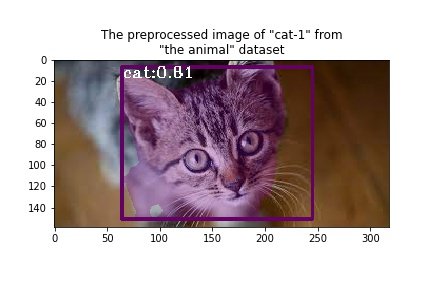

# ONNX Hello World


[](https://github.com/mmgalushka/bootwrap/blob/main/LICENSE)

This project provides educational material for using [Open Neural Network Exchange (ONNX)](https://onnx.ai/). These materials would be useful for data scientists and engineers who are planning to use the ONNX ML models in their AI projects. Using the prepared notebooks you will be to find answers to the following questions: 
* How I can convert my ML classification model built using [SKLearn](https://scikit-learn.org/stable/), [XGBoost](https://xgboost.readthedocs.io/en/latest/), and [Tensorflow (Keras)](https://www.tensorflow.org/) into the ONNX format? 
* What is the difference between the original ML model and the model converted into the ONNX?
* How I can visualize the ONNX graph?
* Where I can find and how I can use already trained and serialized ONNX models?

**Note:** In this project, we will not spend time performing data cleaning, feature selection, selecting the best features, etc. This project is about ONNX!

ONNX

Let me cite a quote defining the goal of the ONNX project defined [here](https://onnx.ai/about.html):

> "Our goal is to make it possible for developers to use the right combinations of tools for their project. We want everyone to be able to take AI from research to reality as quickly as possible without artificial friction from toolchains."

If you would like about ONNX please follow the following [link](https://github.com/onnx/).

You might be asking the question: _why do we need this project if we already have excellent documentation [here](https://github.com/onnx/)_? I believe the best way to learn something new is to try-examples-yourself. So I tried to follow the existing documentation, repeat, and introduce some new steps. This way I tried to learn this technology and decided to share my experience with others.


# Experiments

## SKLearn Model

To run experiments with the [SKLearn](https://scikit-learn.org/stable/) models use [onnx_sklearn.ipynb](onnx_sklearn.ipynb) notebook. Using this notebook we conducted experiments with six SKLearn classifiers. The results of these experiments are presented in the following table.

| Cassifier               | Original | ONNX | Probabilities Difference            |
| ----------------------- | -------- | ---- | ----------------------------------- |
| K-nearest neighbors     | 81%      | 81%  |  |
| Logistic Regression     | 77%      | 77%  |   |
| Random Forest           | 81%      | 81%  |   |
| Support Vector          | 77%      | 77%  |  |
| Gaussian Naive Bay      | 75%      | 75%  |   |
| Multi-layer Perceptron  | 77%      | 77%  |  |

All of our tested classifiers were successfully converted to the ONNX format. The ONNX models produced the same accuracy results as the correspondent ONNX models. Very similar behavior according to the difference in prediction probability showed Logistic Regression, Support Vector, Gaussian Naive Bay, and Multi-layer Perceptron classifiers. K-nearest neighbors and Random Forest classifiers showed surprisingly large differences in prediction probabilities. This potentially may cause a prediction swing to other classes.

## XGBoost Model

To run this experiment use [onnx_xgboost.ipynb](onnx_xgboost.ipynb) notebook. This notebook uses the "iris" classification data set to build the [XGBoost](https://xgboost.readthedocs.io/en/latest/) model and then compares this model to its ONNX representation. The result of the conducted experiment is presented in the following table.

| Cassifier               | Original | ONNX | Probabilities Difference                |
| ----------------------- | -------- | ---- | --------------------------------------- |
| XGBoost                 | 100%     | 100% |  |

Overall the process of working with the XGBoost classifier is very similar to the SKLearn model. You can easily observe this just by comparing both notebooks. The key difference is in performing Registration for the XGBoost convertor:

```Python
from xgboost import XGBClassifier
from skl2onnx import convert_sklearn, update_registered_converter
from skl2onnx.common.shape_calculator import calculate_linear_classifier_output_shapes
from onnxmltools.convert.xgboost.operator_converters.XGBoost import convert_xgboost

...
update_registered_converter(
    XGBClassifier, 'XGBoostXGBClassifier',
    calculate_linear_classifier_output_shapes, convert_xgboost,
    options={'nocl': [True, False], 'zipmap': [True, False, 'columns']})

onnx_model = convert_sklearn(model, initial_types=...)    
...
```

By observing experimental results, original and ONNX models have very similar behavior with **tiny** differences in prediction probability for outliers.

## Tensorflow(Keras) Model

To run this experiment use [onnx_tensorflow.ipynb](onnx_tensorflow.ipynb) notebook. This notebook uses the "adult" classification data set to build the [Tensorflow(Keras)](https://www.tensorflow.org/) model and then compares this model to its ONNX representation. The result of the conducted experiment is presented in the following table.

| Cassifier               | Original | ONNX | Probabilities Difference                          |
| ----------------------- | -------- | ---- | ------------------------------------------------- |
| Tensorflow(Keras)       | 86%      | 86%  |  |

A conversation of the Tensorflow(Keras) model into ONNX format is slightly different from [SKLearn](onnx_sklearn.ipynb) and [XGBoost](onnx_xgboost.ipynb). The main difference lies in preprocessing data. It must be done "manually" before feeding data to the classifier. For the actual model conversion, we tried to use [keras-onnx](https://github.com/onnx/keras-onnx) packages. Unfortunately, the result was unsuccessful. As a workaround, we save the original model in the file using Tensorflow format and convert it into the ONNX using [tf2onnx](https://github.com/onnx/tensorflow-onnx) package.

```Python
import tf2onnx.convert

...
model.save(
    os.path.join('tmp', 'model.h5'),
    overwrite=True, include_optimizer=False, save_format='tf'
)
...
model = keras.models.load_model(os.path.join('tmp', 'model.h5'))
onnx_model, _ = tf2onnx.convert.from_keras(model)
```

By observing experimental results, original and ONNX models have very similar behavior with **tiny** differences in prediction probability for outliers.

## Use Pre-trained ResNet ONNX Model

| Animal      | Original Image                       | Preprocessed Image                   | Label              | Score |
| ----------- | ------------------------------------ | ------------------------------------ | ------------------ | ----- |
| cat-1       |  |  | "tabby, tabby cat" | 12.97 |
| cat-2       |  |  | "tabby, tabby cat" | 7.93  |
| cat-3       |  |  | "Egyptian cat"     | 8.87  |
| dog-1       |  |  | "Labrador retriever" | 14.60  |
| dog-2       |  |  | "Bernese mountain dog" | 13.96   |
| dog-3       |  |  | "Eskimo dog, husky"     | 11.79   |


## Use Pre-trained MaskRCNN ONNX Model

| Animal      | Original Image                                                | Preprocessed Image                                            |
| ----------- | ------------------------------------------------------------- | ------------------------------------------------------------- |
| cat-1       |            |            |
| dog-1       |            |            |
| cat-n       |            |            |
| dog-n       |            |            |
| dog-n-cat   |  |  |

# Links

* ONNX Official Website: https://onnx.ai/
* ONNX GitHub:https://github.com/onnx
* Notebooks: https://github.com/mmgalushka/onnx-hello-world
* Issue Tracker: https://github.com/mmgalushka/onnx-hello-world/issues