# Experiment with MaskRCNN Model

To run experiments with the [MaskRCNN](https://arxiv.org/abs/1703.06870) model use [onnx_maskrcnn.ipynb](../onnx_maskrcnn.ipynb) notebook. Using this notebook we conducted experiments with the Mask-RCNN deep neural network model aimed to solve instance segmentation problem in computer vision.

## Dataset

For prediction experiments, we are using an "animal" data set. This dataset combines photographs cat(s) and dog(s) collected from the internet.

| Animal    | Original Image                               | Preprocessed Image                                           | Postprocessed Image                                            |
| ----------| -------------------------------------------- |------------------------------------------------------------- | ---------------------------------------------------------------|
| cat-1     | 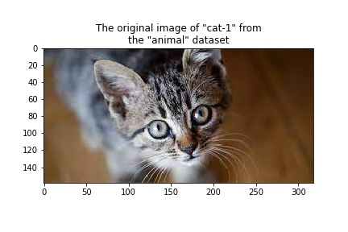         | 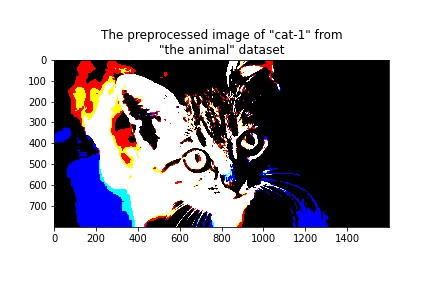         | 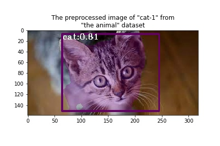         |
| dog-1     | 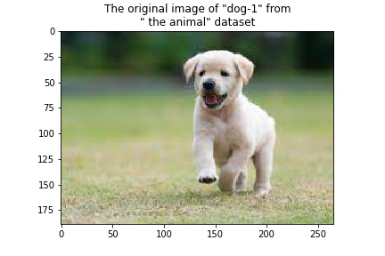         | 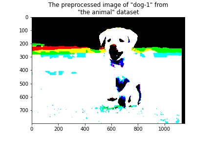         | 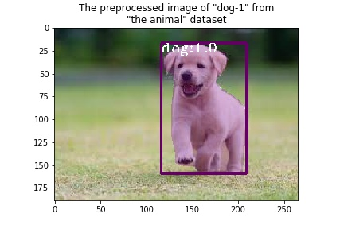         |
| cat-n     | 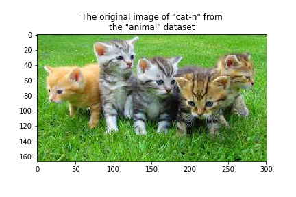         | 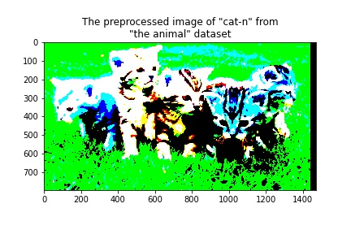         | 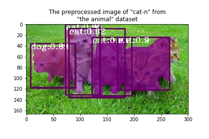         |
| dog-n     | 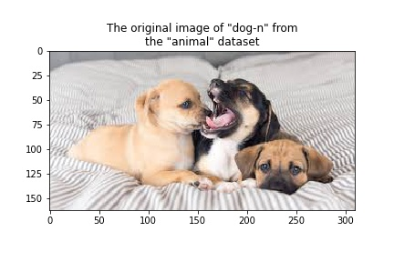         | 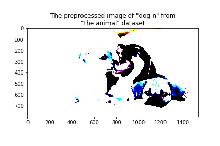         | 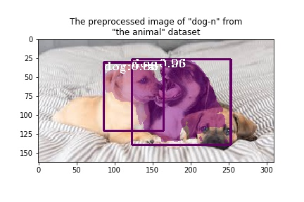         |
| dog-n-cat | 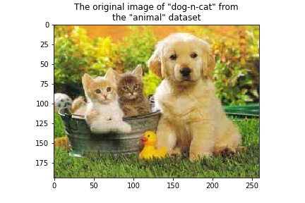 | 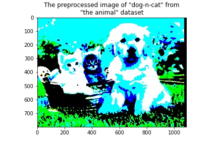 | 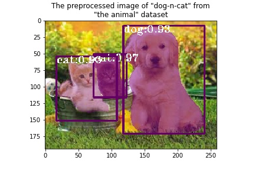 |