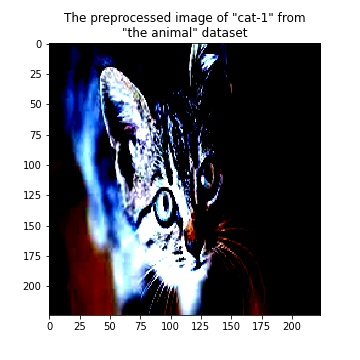
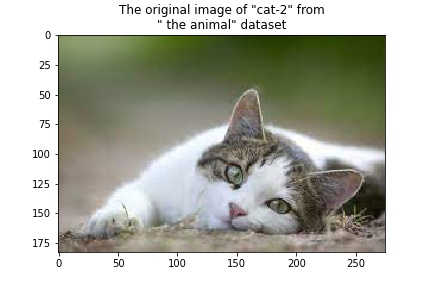
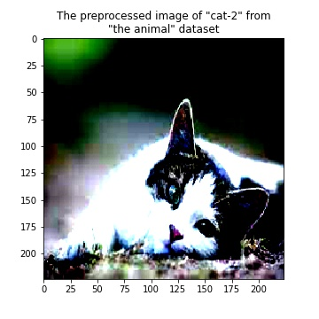
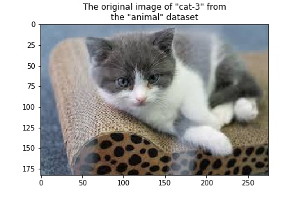
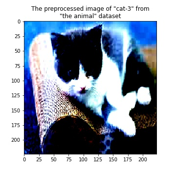
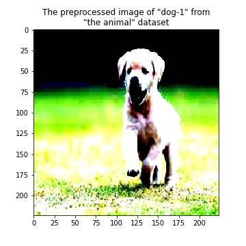
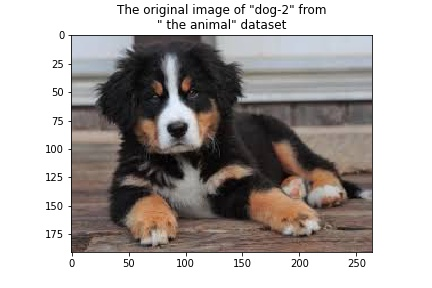
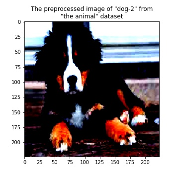
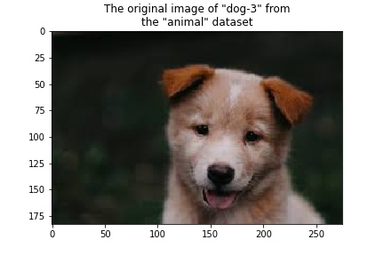
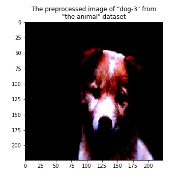

# Experiment with ResNet Model

To run experiments with the [Resnet](https://arxiv.org/abs/1512.03385) model use [onnx_resnet.ipynb](../onnx_resnet.ipynb) notebook. Using this notebook we conducted experiments with the pre-trained ResNet classifier.

## Dataset

For prediction experiments, we are using an "animal" data set. This dataset combines photographs cat(s) and dog(s) collected from the internet.

## Prediction Results

| Animal      | Original Image                       | Preprocessed Image                                      | Label                  | Score |
| ----------- | ------------------------------------------- | ------------------------------------------------ | ---------------------- | ----- |
| cat-1       |  |  | "tabby, tabby cat"     | 12.97 |
| cat-2       |  |  | "tabby, tabby cat"     | 7.93  |
| cat-3       |  |  | "Egyptian cat"         | 8.87  |
| dog-1       |  |  | "Labrador retriever"   | 14.60 |
| dog-2       |  |  | "Bernese mountain dog" | 13.96 |
| dog-3       |  |  | "Eskimo dog, husky"    | 11.79 |
