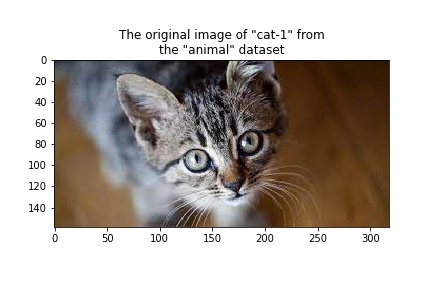

# Experiment with ResNet Model

To run experiments with the pre-trained [Resnet](https://arxiv.org/abs/1512.03385) classifier use [onnx_resnet.ipynb](../onnx_resnet.ipynb) notebook.

## Dataset

For prediction experiments, we are using an "animal" data set. This dataset combines photographs cat(s) and dog(s) collected from the internet.

## Prediction Results

| Animal      | Original Image                       | Preprocessed Image                                      | Label                  | Score |
| ----------- | ------------------------------------------- | ------------------------------------------------ | ---------------------- | ----- |
| cat-1       |  |  | "tabby, tabby cat"     | 12.97 |
| cat-2       |  |  | "tabby, tabby cat"     | 7.93  |
| cat-3       |  |  | "Egyptian cat"         | 8.87  |
| dog-1       |  |  | "Labrador retriever"   | 14.60 |
| dog-2       |  |  | "Bernese mountain dog" | 13.96 |
| dog-3       |  |  | "Eskimo dog, husky"    | 11.79 |

## Summary

To set up the inference process using the pre-trained ResNet was quite straightforward. The image preprocessor was well defined and worked without issues. Despite using the most simple ResNet implementation, the obtained results are good.
