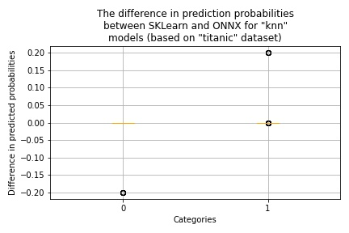
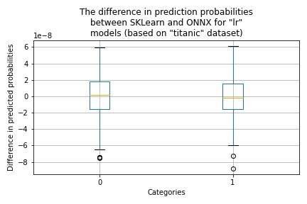
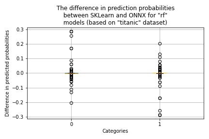
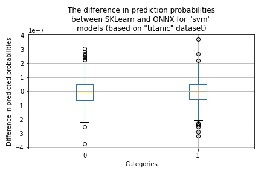
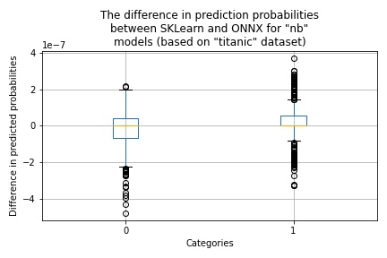
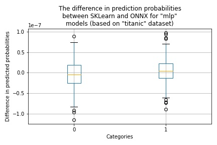
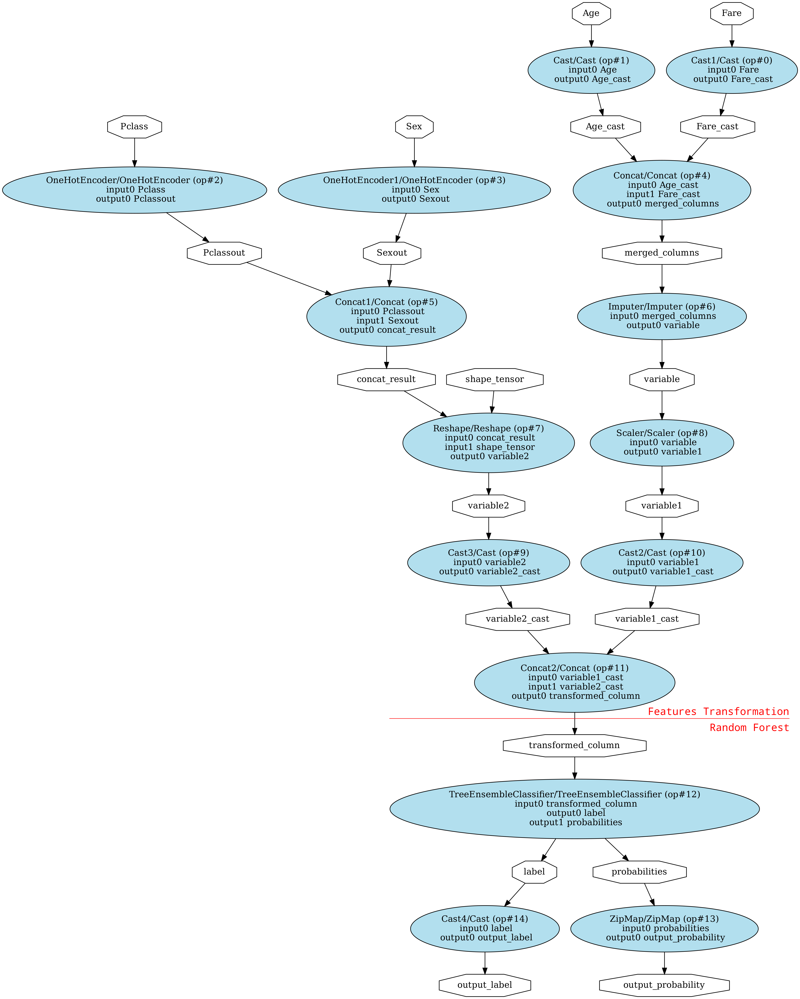

# Experiments with SKLearn Models

To run experiments with the [SKLearn](https://scikit-learn.org/stable/) models use [onnx_sklearn.ipynb](../onnx_sklearn.ipynb) notebook. Using this notebook we conducted experiments with six SKLearn classifiers: K-nearest neighbors, Logistic Regression, Random Forest, Support Vector, Gaussian Naive Bayes, and Multi-layer Perceptron.

## Dataset

For performing experiments, we will be using the "titanic" classification data set. This dataset describes the survival status of individual passengers on the Titanic. It contains a combination of numeric and categorical features showing in the following table.

| Feature      | Kind        | Target             |
| ------------ | ----------- | ------------------ |
| Pclass       | categorical | :x:                |
| Sex          | categorical | :x:                |
| Age          | numeric     | :x:                |
| Fare         | numeric     | :x:                |
| Survived     | categorical | :heavy_check_mark: |

The "Survived" field defines a passenger survived status (**0**-not survived and **1**-survived).

This combination of features is useful for testing the data preprocessing pipeline.

## Model Conversion

The process of converting the SKLearn model to ONNX is relatively straightforward, you need to call function **convert_sklearn** and specify your custom model.

```Python
from skl2onnx import convert_sklearn

# Trains a custom model.
my_model = ...

# Creates input type using dataset schema.
initial_type = ...

# Converts the model to the ONNX format.
onnx_model = convert_sklearn(my_model, initial_types=initial_type)
```

To use **convert_sklearn** function you need to install the [skl2onnx package](https://pypi.org/project/skl2onnx/):

```Bash
~$ pip install skl2onnx
```

There are not all SKLearn components are available for conversion. To check which SKLearn components are supported, please use the following [link](https://onnx.ai/sklearn-onnx/supported.html).

## Models Comparison Results

The results of conducted experiments are presented in the following table.

| Cassifier               | Original | ONNX | Probabilities Difference            |
| ----------------------- | -------- | ---- | ----------------------------------- |
| K-nearest neighbors     | 81%      | 81%  |     |
| Logistic Regression     | 77%      | 77%  |       |
| Random Forest           | 81%      | 81%  |       |
| Support Vector          | 77%      | 77%  |     |
| Gaussian Naive Bayes    | 75%      | 75%  |       |
| Multi-layer Perceptron  | 77%      | 77%  |     |

## ONNX Model Graphs

To generate SKLearm ONNX model graphs use the [onnx_graph.onnx](../onnx_graph.onnx) notebook. The red line (drawn manually) on the graph images shows the separation between the features transformation and classifier parts.

### K-nearest neighbors Classifier


### Random Forest Classifier



## Summary

All tested classifiers were successfully converted to the ONNX format. The ONNX models produced the same accuracy results as the correspondent SKLearn models. Very similar behavior (according to the difference in prediction probability) showed Logistic Regression, Support Vector, Gaussian Naive Bay, and Multi-layer Perceptron classifiers. K-nearest neighbors and Random Forest classifiers showed surprisingly large differences in prediction probabilities for some samples. This potentially may cause a prediction swing to other classes.
