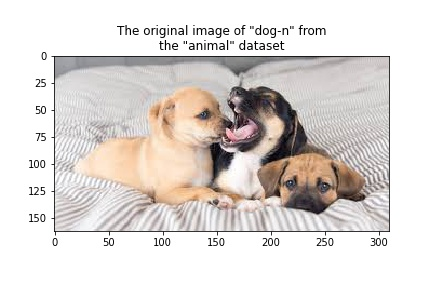
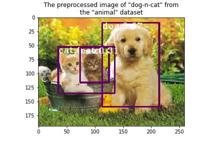

# Experiment with Single Shot MultiBox Detector (SSD)

To run experiments with the [SSD](https://arxiv.org/abs/1512.02325) model use [onnx_ssd.ipynb](../onnx_ssdn.ipynb) notebook. Using this notebook we conducted experiments with the SSD deep neural network model aimed to solve objects detection problem in computer vision.

## Dataset

For prediction experiments, we are using an "animal" data set. This dataset combines photographs cat(s) and dog(s) collected from the internet.

| Animal | Original Image | Preprocessed Image | Postprocessed Image | Score Threshold |
| -------| -------------- |------------------- | ------------------- | --------------- |
| cat-1|  |  | | 0.7 |
| dog-1|  |  | | 0.7 |
| cat-n|  |  | | 0.15 |
| dog-n|  |  | | 0.2 |
| dog-n-cat |  |  |  | 0.3 |