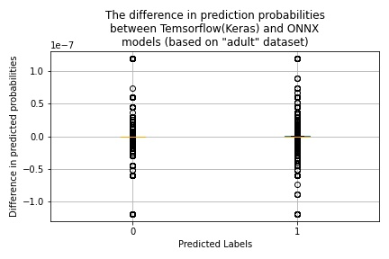

# Experiment with Tensorflow(Keras) Model

To run experiments with the [Tensorflow(Keras)](https://www.tensorflow.org/) classifier use [onnx_tensorflow.ipynb](onnx_tensorflow.ipynb) notebook.

## Dataset

For performing experiments, we will be using the "adult" classification data set. This dataset is based on the Census Bureau and used for predicting whether a given adult makes more than $50,000 based on features presented in the following table.

| Feature      | Kind        | Target             |
| -------------| ----------- | ------------------ |
| Age          | numeric     | :x:                |
| fnlwgt       | numeric     | :x:                |
| EducationNum | numeric     | :x:                |
| CapitalGain  | numeric     | :x:                |
| CapitalLoss  | numeric     | :x:                |
| HoursPerWeek | numeric     | :x:                |
| WorkClass    | categorical | :x:                |
| Education    | categorical | :x:                |
| MaritalStatus| categorical | :x:                |
| Occupation   | categorical | :x:                |
| Relationship | categorical | :x:                |
| Race         | categorical | :x:                |
| Gender       | categorical | :x:                |
| NativeCountry| categorical | :x:                |
| Income       | categorical | :heavy_check_mark: |

The "Income" field defines two income categories: **<=50K** and **>50K**.

## Model Conversion

A conversation of the Tensorflow(Keras) model into ONNX format is slightly different from [SKLearn](onnx_sklearn.ipynb) and [XGBoost](onnx_xgboost.ipynb). The main difference lies in preprocessing data. It must be done "manually" before feeding data to the classifier. For the actual model conversion, we tried to use [keras-onnx](https://github.com/onnx/keras-onnx) packages. Unfortunately, the result was unsuccessful. As a workaround, we save the original model in the file using Tensorflow format and convert it into the ONNX using [tf2onnx](https://github.com/onnx/tensorflow-onnx) package.

The process of converting the Tensorflow(Keras) model to ONNX is performed by the **tf2onnx.convert.from_keras** function:

```Python
import tf2onnx.convert

# Trains a custom model.
my_model = ...

# Creates input type using dataset schema.
initial_type = ...

# Converts the model to the ONNX format.
onnx_model, _ = tf2onnx.convert.from_keras(my_model)
```

To use **tf2onnx.convert.from_keras** function you need to install the [tf2onnx package](https://pypi.org/project/tf2onnx/):

```Bash
~$ pip install tf2onnx
```

One important remark. The converted model must be in the Tensorflow graph (not Keras). To obtain the correct model representation, serialize it and reload as following:

```Python
...
# Save the model using TF format.
my_model.save(
    'model.h5',overwrite=True, include_optimizer=False, save_format='tf'
)
# Load the model using TF format.
my_model = keras.models.load_model('model.h5')
```

Make sure that you are using this argument `save_format='tf'`

## Models Comparison Results

The results of conducted experiments are presented in the following table.

| Cassifier               | Original | ONNX | Probabilities Difference                          |
| ----------------------- | -------- | ---- | ------------------------------------------------- |
| Tensorflow(Keras)       | 86%      | 86%  |     |

## ONNX Model Graphs

To generate the Tensorflow ONNX model graph use the [onnx_graph.onnx](../onnx_graph.onnx) notebook. Please note, that we were using the red line (drawn manually) on the [SKLearn](sklearn.md) and [XGBoost](xgboost.md) graph images to show the separation between the features transformation and classifier parts. For the Tensorflow model, we perform transformation before fitting the model, because of this our graph does not have the transformation part.


## Summary

By observing experimental results, original and ONNX models have very similar behavior with **tiny** differences in prediction probability for outliers.
