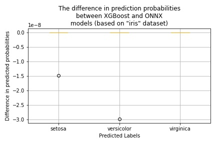
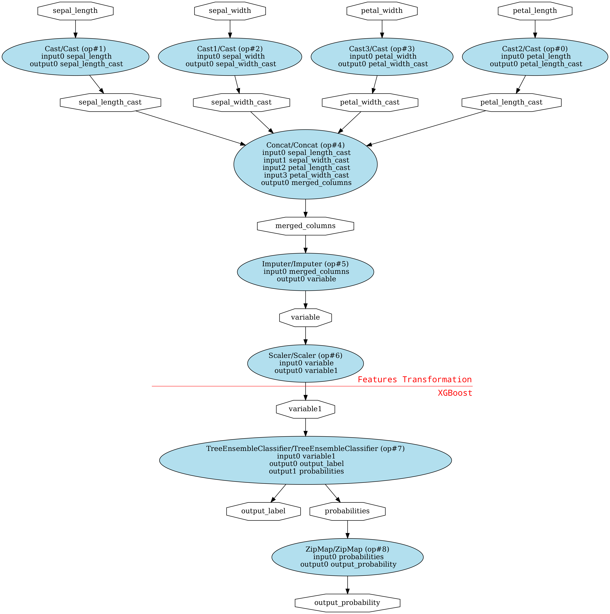
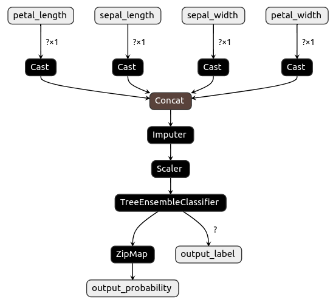

# Experiment with XGBoost Model

To run experiments with the [XGBoost](https://xgboost.readthedocs.io/en/latest/) classifier use [onnx_xgboost.ipynb](../onnx_xgboost.ipynb) notebook.

## Dataset

For performing experiments, we will be using the "iris" classification data set. This dataset describes three species of Iris flower using four numeric features presented in the following table:

| Feature      | Kind        | Target             |
| -------------| ----------- | ------------------ |
| sepal_length | numeric     | :x:                |
| sepal_width  | numeric     | :x:                |
| petal_length | numeric     | :x:                |
| petal_width  | numeric     | :x:                |
| class        | categorical | :heavy_check_mark: |

The "class" field defines three species of Iris (Iris **setosa**, Iris **virginica** and Iris **versicolor**).

## Model Conversion

Overall the process of working with the XGBoost classifier is very similar to the SKLearn model. The key difference is in performing Registration for the XGBoost converter:

```Python
from xgboost import XGBClassifier
from skl2onnx import convert_sklearn, update_registered_converter
from skl2onnx.common.shape_calculator import calculate_linear_classifier_output_shapes
from onnxmltools.convert.xgboost.operator_converters.XGBoost import convert_xgboost

...
update_registered_converter(
    XGBClassifier, 'XGBoostXGBClassifier',
    calculate_linear_classifier_output_shapes, convert_xgboost,
    options={'nocl': [True, False], 'zipmap': [True, False, 'columns']})


# Trains a custom model.
my_model = ...

# Creates input type using dataset schema.
initial_type = ...

# Converts the model to the ONNX format.
onnx_model = convert_sklearn(my_model, initial_types=initial_type) 
```

To use **convert_sklearn** function you need to install the [skl2onnx package](https://pypi.org/project/skl2onnx/) together with [onnxmltools](https://pypi.org/project/onnxmltools/):

```Bash
~$ pip install skl2onnx
~$ pip install onnxmltools
```

## Models Comparison Results

The results of conducted experiments are presented in the following table.

| Cassifier               | Original | ONNX | Probabilities Difference                 |
| ----------------------- | -------- | ---- | ---------------------------------------- |
| XGBoost                 | 100%     | 100% |  |

## ONNX Model Graphs

### Using Jupyter Notebook

To generate the XGBoost ONNX model graph use the [onnx_graph.onnx](../onnx_graph.onnx) notebook. The red line (drawn manually) on the graph image shows the separation between the features transformation and XGBoost classifier parts.



### Using Netron Tool

To visualize the ONNX model using the Netron tool use the following command:

```Bash
~$ ./helper.sh netron tmp/model.onnx
```

:point_up: Make sure that you correctly defined a path to the ONNX model file.



## Summary

By observing experimental results, original and ONNX models have very similar behavior with **tiny** differences in prediction probability for outliers.
